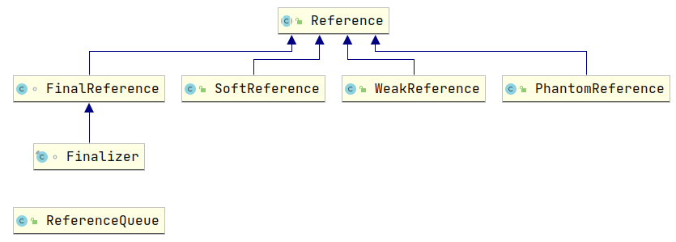
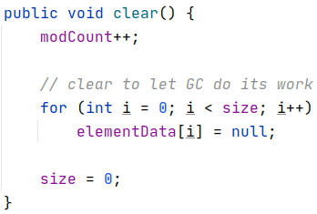

# 理解Java的强引用、软引用、弱引用和虚引用

## 1. Reference 源码分析

### 1.1. Reference 的简介和分类



`Reference` 是所有引用对象的基类, 这个类定义了所有引用对象的通用操作. 

由于 `Reference` 实例是由 JVM 创建, 所以自行继承 `Reference` 实现自定义的引用类型是无意义的, 但是可以继承已经存在的引用类型, 如 `SoftReference` 等.


在 JDK1.2 之前, Java 中引用的定义是十分传统: 如果 reference 类型存储的数值代表的是另一块内存的起始地址, 就称这块内存代表着一个引用. 在这种定义之下, 一个对象只有被引用和没有被引用两种状态.

实际上, 我们更希望存在这样的一类对象: 当内存空间还足够的时候, 这些对象能够保留在内存空间中; 如果当内存空间在进行了垃圾收集之后还是非常紧张, 则可以抛弃这些对象. 基于这种特性, 可以满足很多系统缓存功能的使用场景.

`java.lang.ref` 包是 JDK1.2 引入的, 包结构和类分布如下:

```java
- java.lang.ref
  - Cleaner.class
  - Finalizer.class
  - FinalizerHistogram.class
  - FinalReference.class
  - PhantomReference.class
  - Reference.class
  - ReferenceQueue.class
  - SoftReference.classs
  - WeakReference.class
```

引入此包的作用是对引用的概念进行了扩充, 将引用分为强引用(Strong Reference)、软引用(Soft Reference)、弱引用(Weak Reference) 和虚引用(Phantom Reference) 四种类型的引用, 还有一种比较特殊的引用是析构引用(Final Reference), 它是一种特化的虚引用.

四种引用的强度按照下面的次序依次减弱:

```java
StrongReference > SoftReference > WeakReference > PhantomReference
```

值得注意的是:

- 强引用没有对应的类型表示, 也就是说强引用是普遍存在的, 如 `Object object = new Object();`.
- 软引用、弱引用和虚引用都是 `java.lang.ref.Reference` 的直接子类.

### 1.2. Reference 源码分析

先看 `Reference` 的构造方法和成员变量:

```java
public abstract class Reference<T> {
    private T referent;
    volatile ReferenceQueue<? super T> queue;
    volatile Reference next;
    transient private Reference<T> discovered;
    
    Reference(T referent) {
        this(referent, null);
    }

    Reference(T referent, ReferenceQueue<? super T> queue) {
        this.referent = referent;
        this.queue = (queue == null) ? ReferenceQueue.NULL : queue;
    }
}
```

**构造描述**：

构造方法依赖于一个泛型的 referent 成员以及一个 `ReferenceQueue<? super T>` 的队列, 如果 `ReferenceQueue` 实例为 null, 则使用 `ReferenceQueue.NULL`.

**成员变量描述**：

- referent: 保存了 `Reference` 引用所指向的对象, 下面直接称为 referent.

```java
// GC特殊处理的对象
private T referent;         /* Treated specially by GC */
```

- queue: 当 `Reference` 实例持有的对象 referent 要被回收的时候, `Reference` 实例会被放入引用队列, 那么程序执行的时候可以从引用队列得到或者监控相应的 `Reference` 实例.

```java
    /* The queue this reference gets enqueued to by GC notification or by
     * calling enqueue().
     *
     * When registered: the queue with which this reference is registered.
     *        enqueued: ReferenceQueue.ENQUEUE
     *        dequeued: ReferenceQueue.NULL
     *    unregistered: ReferenceQueue.NULL
     */
    volatile ReferenceQueue<? super T> queue;
```


`Reference` 对象关联的引用队列, 对象如果即将被垃圾收集器回收, 此队列作为通知的回调队列, 也就是


## 2. 强引用(StrongReference)

强引用是使用最普遍的引用. 如果一个对象具有强引用, 那垃圾回收器绝不会回收它. 如下:

```java
Object strongReference = new Object();
```

当内存空间不足时, Java 虚拟机宁愿抛出 `OutOfMemoryError` 错误, 使程序异常终止, 也不会靠随意回收具有强引用的对象来解决内存不足的问题.

如果强引用对象不使用时, 需要弱化从而使 GC 能够回收, 如下:

```java
strongReference = null;
```

显式地设置 `strongReference` 对象为 `null`, 或让其超出对象的生命周期范围, 则 gc 认为该对象不存在引用, 这时就可以回收这个对象. 具体什么时候收集这要取决于 GC 算法.

```java
public void test() {
    Object strongReference = new Object();
    // 省略其他操作
}
```

在一个方法的内部有一个强引用, 这个引用保存在 Java 栈中, 而真正的引用内容(`Object`) 保存在 Java 堆中.

当这个方法运行完成后, 就会退出方法栈, 则引用对象的引用数为0, 这个对象会被回收.

但是如果这个 `strongReference` 是全局变量时, 就需要在不用这个对象时赋值为 `null`, 因为强引用不会被垃圾回收.

`ArrayList` 的 `clear` 方法:



在 `ArrayList` 类中定义了一个 `elementData` 数组, 在调用 `clear` 方法清空数组时, 每个数组元素被赋值为 `null`.

不同于 `elementData=null`, 强引用仍然存在, 避免在后续调用 `add()` 等方法添加元素时进行内存的重新分配.

## 3. 软引用(SoftReference)

如果一个对象只具有软引用, 则内存空间充足时, 垃圾回收器就不会回收它; 如果内存空间不足了, 就会回收这些对象的内存. 只要垃圾回收器没有回收它, 该对象就可以被程序使用.

> 软引用可用来实现内存敏感的高速缓存。

```java
String str = new String("abc");
SoftReference<String> softReference = new SoftReference<String>(str);
```

软引用可以和一个引用队列(`ReferenceQueue`) 联合使用. 如果软引用所引用对象被垃圾回收, JAVA 虚拟机就会把这个软引用加入到与之关联的引用队列中.


## 讨论

**1.对于 不同于 `elementData=null`, 强引用仍然存在 这句话的理解.**


## 参考资料

[深入理解JDK中的Reference原理和源码实现](https://www.throwable.club/2019/02/16/java-reference/)   [浏览本地页面](./html/深入理解JDK中的Reference原理和源码实现 - Throwable.html)


[理解Java的强引用、软引用、弱引用和虚引用](https://juejin.im/post/6844903665241686029)

[Java引用总结--StrongReference、SoftReference、WeakReference、PhantomReference](https://www.cnblogs.com/skywang12345/p/3154474.html)

